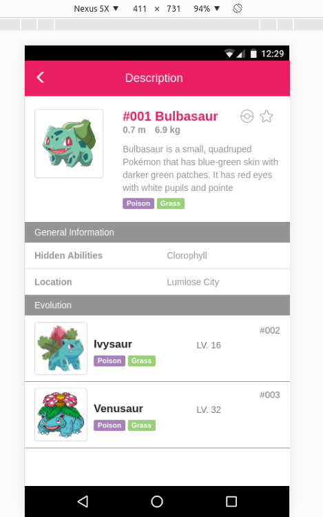

# Code Challenge 1 - Mauricio A. T.


## Information
Pokedex application in javascript
<table>

<tr>
<td>Name</td>
<td>Version</td>
</tr>

<tr>
<td>Node</td>
<td>>= 4.x</td>
</tr>

<tr>
<td>Bower</td>
<td>>=1.7.x</td>
</tr>

<tr>
<td>Gulp</td>
<td>>=3.x</td>
</tr>

</table>

## Installation

```
npm install
npm run bower
npm start

```

## Demo


